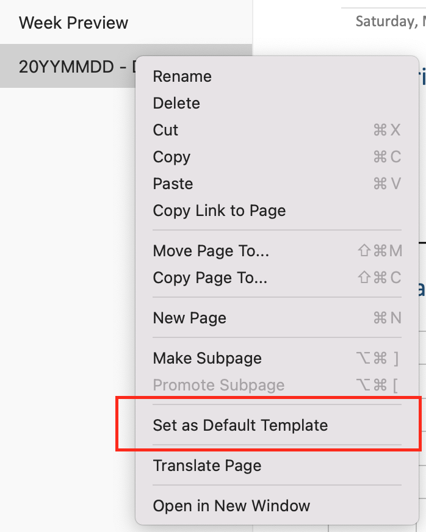

# Planner-OneNote

## Using the Planner

I highly recommend reading "Free to Focus" by Michael Hyatt.  This book is a quick read and jam packed with a really helpful meta-thought process.

## Installing the Planner

1) Download the Planner Zip file to your desktop from:

2) Unzip the file if your operating system didn’t do it for you automatically

3) The planner can be imported to your OneNote using the OneNote Importer.  See the Instructions below

Export / Import OneNote Notebooks

https://support.microsoft.com/en-ie/office/export-and-import-onenote-notebooks-a4b60da5-8f33-464e-b1ba-b95ce540f309

4) Rename the notebook.  When the notebook is imported, it ends up in your OneDrive.  The Notebook can be renamed through using the instructions below.
	
Rename OneNote Notebooks

https://support.microsoft.com/en-us/office/rename-a-notebook-in-onenote-for-the-web-d75e88d2-ef77-43eb-a870-0abe89c1a036

5) Add the notebook to your client as usual.

## Pro-Tip:

The Planner has emphasizes weekly planning.  Under the weekly section group, there is a section for every week of the year.  The daily planner is located under the corresponding week of the year.  This is where you keep track of your days.  The weekly section contains a template named 20YYMMDD - DOW for your daily calendar.  

You can copy and paste this for every day in the week, or set it as the default template for the section.  You will need to repeat this process for every week.  (I set this up for you but OneNote doesn’t keep the setting between exporting and importing.) 

	- Daily Template
		○ Set as default template

